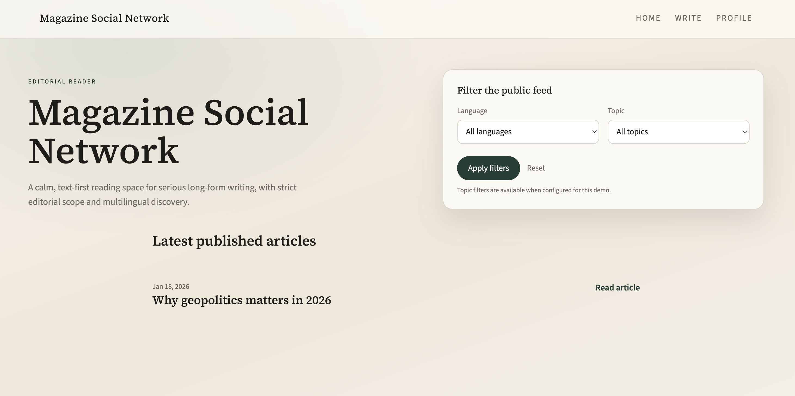
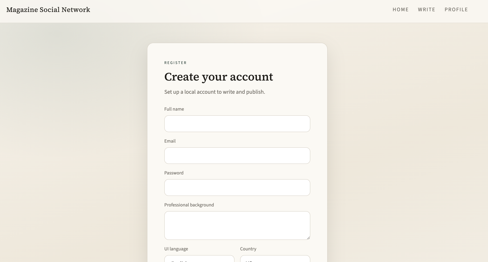
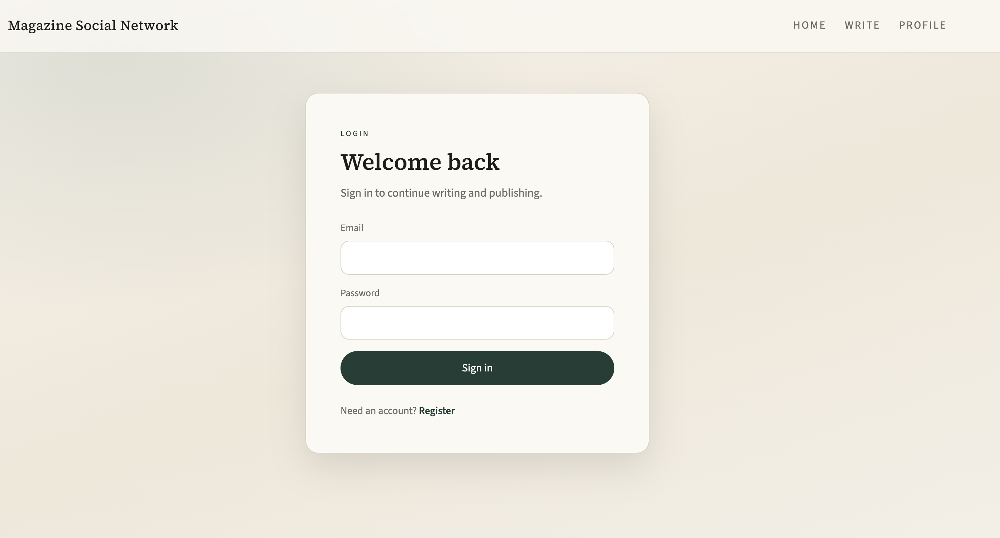
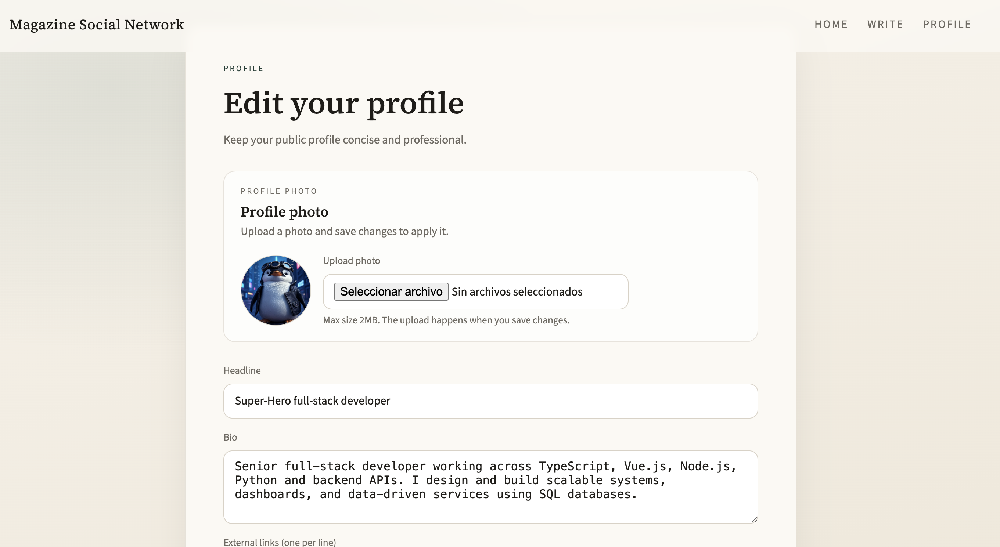
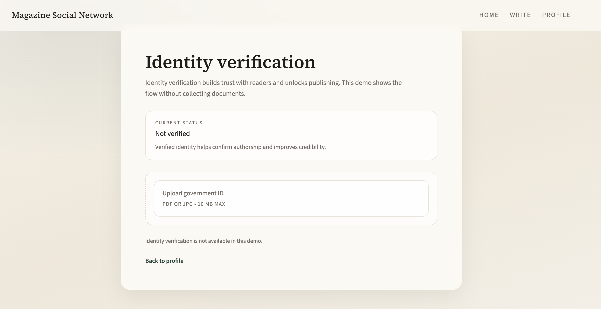
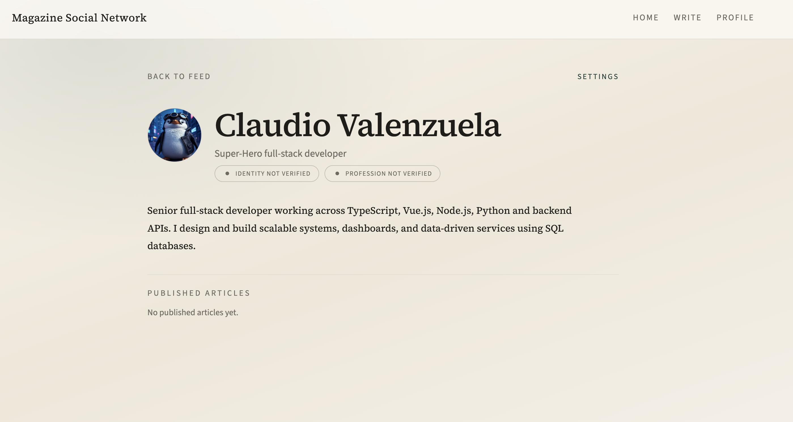
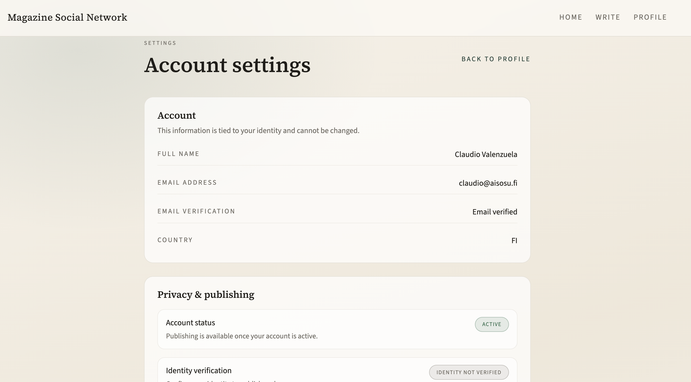
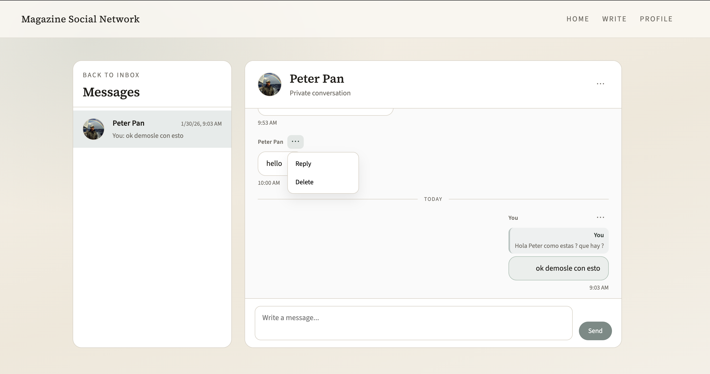

# Magazine Social Network

Magazine Social Network is a text-first editorial platform designed for professional
writers, researchers, and subject-matter experts who publish within topic- and
language-scoped magazines. It deliberately bridges the gap between social networks
and editorial publications through a structured, read-only environment for long-form work.

## Product Philosophy

- Text-first: writing is the primary medium, not a wrapper for engagement.
- Long-form: depth, context, and rigor are first-class.
- Editorial scope: publications are bound to a topic and a language.
- Real identities: accountability is built into the author profile.
- Multilingual separation: content is discoverable without cross-language dilution.

## User Experience

### Registration & login

Session-based onboarding keeps the platform focused on verified, accountable publishing.

### Profile & identity

Professional profiles keep public presence structured and consistent across publications.

Identity verification reinforces trust without bringing personal documents into the system.

### Public professional presence

Public profiles present verified identity signals alongside long-form work.

### Account & privacy controls

Clear account controls keep privacy, verification, and session management explicit.

### Private messaging

Private, one-to-one, professional, inbox-style messaging with full message history.
Conversations use a scrollable panel with a fixed composer and per-message actions
for reply and delete. The system is intentionally not social: no public comments,
no reactions, no engagement metrics, and no algorithmic feeds.

## Current Scope (MVP)

- Node.js + TypeScript API with PostgreSQL storage
- Magazines scoped to a single topic and language
- Article lifecycle with explicit states (draft, submitted, published)
- Article version history preserved in the database
- Public read endpoints for articles and public profiles
- Minimal Next.js read-only reader UI for feed, article, and public profile pages
- Session-based authentication with email verification
- Private one-to-one messaging between verified users
- Seeded languages and topics for filtering

## Explicitly Out of Scope

- Authentication providers or production auth
- Social graph, likes, reactions, or algorithmic feeds
- Public comments or discussion threads
- Group messaging or channels
- Notifications or real-time presence indicators
- Media uploads (images, video, audio, embeds)
- Monetization, subscriptions, or payments
- Organization accounts or multi-author ownership
- Automatic translation or ranking systems

## High-Level Architecture

- Backend: Express API in Node.js + TypeScript, PostgreSQL, raw SQL migrations
- Frontend: Next.js read-only UI consuming the public API
- Architecture details: `docs/architecture.md`

Designed for simplicity and auditability, with explicit state transitions and
clear data ownership boundaries.

## Professional Verification (AI-assisted)

### Goal
- Ensure users are who they claim to be professionally
- Scale verification beyond manual review
- Keep a clear, auditable state machine

### Professional verification state machine
- `empty`
- `pending`
- `ai_verified`
- `rejected`

### End-to-end flow in phases

Phase A — Profile & CV data collection
- Capture structured profile details and career history in a format suitable for automated analysis.

Phase B — Verification request
- Users explicitly request verification, creating a request record independent of profile edits.

Phase C — AI-assisted verification analysis (deterministic, explainable)
- Analysis evaluates consistency and professional plausibility using deterministic checks and explainable signals.

Phase D — Post-verification actions
- The system records the outcome and propagates a stable verification status without altering core profile data.

### Design principles
- Decoupled flows (request, analysis, post-actions)
- AI never directly mutates core user data
- All transitions are validated
- Human-readable reasons are always stored

### Scope
- This is a demo-grade but production-inspired architecture
- No real identity documents are processed
- AI decisions are explainable and reversible

## Why this matters for enterprise platforms

This model mirrors enterprise requirements where governance and trust outweigh speed,
and every decision is traceable.

- Scalability
- Governance
- Trust
- Auditability

## Repository Structure

- `/backend`: API, database access, and SQL migrations
- `/frontend`: Next.js reader interface
- `/docs`: product and architecture documentation

## Local Development

Backend:
1. Start PostgreSQL:
   - `docker compose -f backend/docker/docker-compose.yml up -d`
2. Configure environment variables:
   - `cp backend/.env.example backend/.env`
3. Apply database migrations (in order):
   - `for f in backend/src/db/migrations/*.sql; do psql "$DATABASE_URL" -f "$f"; done`
4. Install dependencies and run the API:
   - `cd backend`
   - `npm install`
   - `npm run dev`

Frontend:
1. Install dependencies:
   - `cd frontend`
   - `npm install`
2. Optional environment variables in `frontend/.env.local`:
   - `NEXT_PUBLIC_API_URL` (defaults to `http://localhost:3000`)
   - `NEXT_PUBLIC_TOPIC_GEOPOLITICS_ID`
   - `NEXT_PUBLIC_TOPIC_TECHNOLOGY_ID`
   - `NEXT_PUBLIC_TOPIC_SCIENCE_ID`
   - `NEXT_PUBLIC_TOPIC_ECONOMICS_ID`
3. Run the Next.js app:
   - `npm run dev`

Required environment variables:
- `DATABASE_URL`: PostgreSQL connection string used by the API
- `SESSION_SECRET`: Session signing secret for cookie-based auth

## Project Status

- Foundation complete
- Read-only MVP (by design)
- Ready for evaluation and iteration
Note: Repository update tested through AgentDock mobile workflow.
